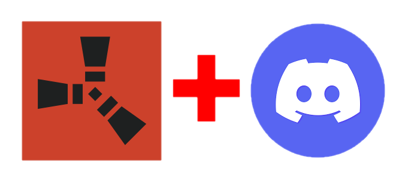
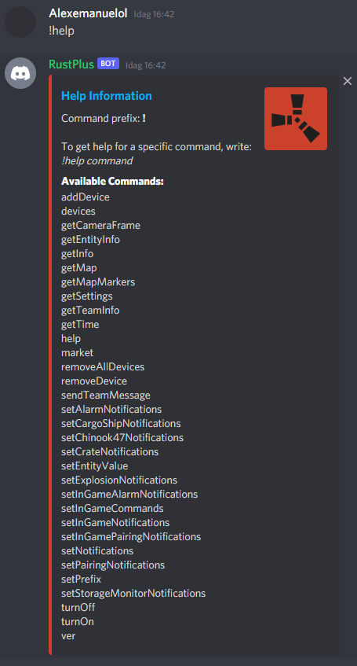
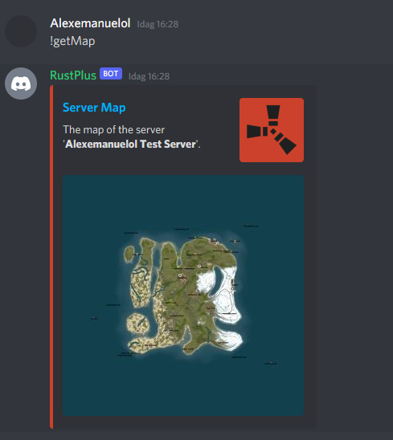
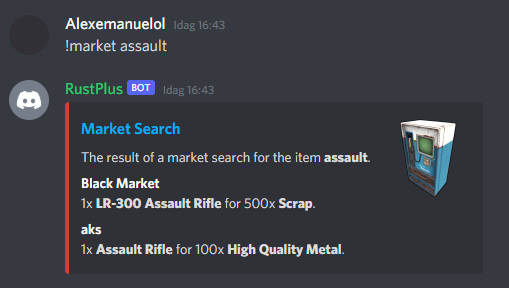
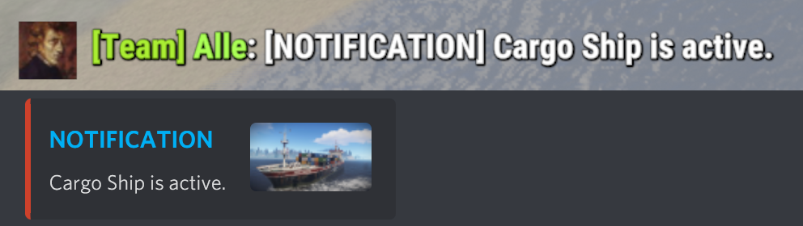
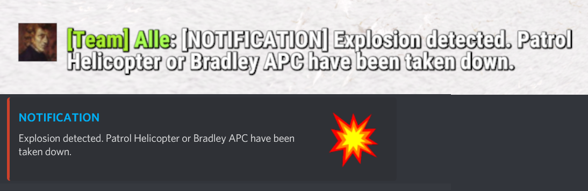

</a>

<h1 align="center">RustPlus-Discord-Bot</h1>

A NodeJS Discord Bot that uses the rustplus.js library to interact with Smart Devices, search for items for sale in vending machines, notify about in-game events such as Cargo Ship spawning or trigger of oilrig and other methods that is available through the [Rust](https://store.steampowered.com/app/252490/Rust/)+ companion app.

# How-To Setup

## Setup Video

[How to setup the RustPlus-Discord-Bot](https://youtu.be/7cdn1dPMEKU)
## Required Software

Follow the instructions for your operating system.

### Windows
Download the following:

- NodeJS - [Link to download page.](https://nodejs.org/en/download/)
- Git - [Link to download page.](https://git-scm.com/downloads)

### Ubuntu
Run the following commands:

    $ sudo apt update
    $ sudo apt install nodejs=14.17.3 npm=6.14.13 git

### Arch Linux
Run the following command:

    $ sudo pacman -S nodejs=14.17.3 npm=6.14.13 git

## Setup the BOT

Open a terminal and run the following commands to clone the repository and install the required packages:

    $ git clone https://github.com/alexemanuelol/RustPlus-Discord-Bot.git
    $ cd RustPlus-Discord-Bot
    $ npm install

Run the following command to register with FCM, Expo and link your Steam Account with Rust+.

    $ npx @liamcottle/rustplus.js fcm-register

**NOTE:** Chrome/ Chromium is required for this step to work. It will open up an instance of the browser where you will have to sign in with your Steam Account and link with Rust+:

This will generate the configuration file *rustplus.config.json* which should remain in the same folder as the *rustplusDiscordBot.js* script.

Before we can start the BOT, we need to sort out the config.json file. There are some properties that needs to be filled out, these are:
- **steamId**
- **serverIp**
- **appPort**
- **playerToken**
- **token**
- **botSpamChannel**

The first 4 properties can easily be accessed by running the script:

    $ node tools/external/copy_server_details_to_config.js

While this script is running, you simply join the rust server you want to play on, enter the menu and click on 'Rust+' and then press either 'PAIR WITH SERVER' or 'RESEND'. This will trigger a FCM notification that includes **steamId**, **serverIp**, **appPort**, **playerToken** and will automatically be copied into your config.json file.

**token** property can be gained by creating a [Discord BOT](https://discordpy.readthedocs.io/en/stable/discord.html) for your Discord Server and copying the bot token into the config.json file.

**botSpamChannel** property can be gained by choosing one of the text channels in your Discord Server and simply copy the channel ID into the config.json file.

# Documentation

*docs/documentation.md* includes a detailed guide to all available commands and all the configuration settings.

[Documentation](docs/documentation.md)

# Screenshots and GIFs

## TurnOn Smart Switches

## Pairing with Smart Devices

## Running the help command

## Running the getMap command

## Running the market command with assault as keyword

## CargoShip active notification

## Explosion detected notification

# Thanks to

**liamcottle**@GitHub - for the [rustplus.js](https://github.com/liamcottle/rustplus.js) library
